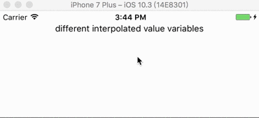

## react-native-auto-scrolling-message

### Demo


### Basic usage
```js
import React from 'react';
import { Text, View, Image } from 'react-native';
import ScrollingMessageView from 'react-native-auto-scrolling-message'

export default class App extends React.Component {
  render () {
    return (
      <ScrollingMessageView
        height={40}
        childrenHeight={20}
        duration={2000}
        containerStyle={{backgroundColor: '#fff'}}
        childrenStyle={{backgroundColor: '#fff'}}
      >
        <View>
          <Image source={{uri: 'https://facebook.github.io/react/img/logo_og.png'}}
            style={{width: 50, height: 50}}
           />
          <Text>Open up App.js to start working on your app!</Text>
        </View>
        <Text>In the render method, we create!</Text>
        <Text>different interpolated value variables</Text>
      </ScrollingMessageView>
    )
  }
}
```

### Props
* height: container height, default 40
* childrenHeight: scrolling object height, default 20
* duration: duration for each flash, default 2000ms
* containerStyle: custom style for the component container
* childrenStyle: custom scrolling object style
